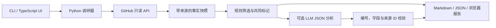

# 设计取舍

## 数据流

调研器与 HTTP/CLI 分离。测试可注入 GitHub 客户端和模型响应，无需网络或付费密钥。浏览器通过任务 ID 查询进度；服务同时执行最多两项任务。

## 为什么先用确定性采集

Issue 状态、assignee 和关联 PR 有可查询的数据来源。把这些事实直接交给模型猜测会增加不必要的不确定性。模型只承担分析和建议，不能改变事实或触发外部操作。

## 为什么使用来源 ID

模型不生成 URL，而是引用已有的 `issue-42` / `doc-1` 等 ID。每条建议必须引用对应 issue；跨候选引用、未知 ID、重复/遗漏 issue 或无效字段会使分析失败。UI 从事实快照中解析链接。

这只能防止不存在的引用，不能证明模型的推论正确。语义归因仍需要人工标注与评测。

## 为什么保留“待核实”

API 分页限制、网络错误、认领表述差异和标题相似度都会影响判断。例如，相关 PR 可能只是提及 issue，并未解决同一个问题；因此暂缓表示先比较 diff，而不是断言已经有人实现同一修复。

## 为什么先做本地工具

本地使用减少账户系统和云部署的复杂度，便于用户使用自己的 GitHub/模型配置。HTTP 服务仅监听 loopback，限制 Host、同源请求和任务数量；网页只渲染文本与经过验证的 GitHub HTTPS 链接。它尚不是经过安全审计的公网服务。

## 后续扩展应保留的约束

新增模型、缓存、源码搜索或贡献政策解析时，均需保留采集时间、来源、覆盖范围和失败信息。若以后增加实际提交能力，应做成独立的人工审阅流程，不能由 issue 或模型内容直接触发。
